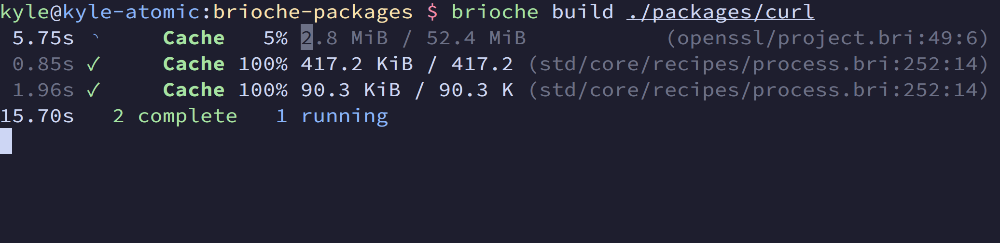

Brioche v0.1.8 is a pretty small release overall, with a few quality-of-life improvements, plus some enhancements to prepare for some future changes.

To get right into it, you can run `brioche self-update` to upgrade, or check the [installation docs](/docs/installation) if you don't have Brioche installed yet. You can also take a look at [the release notes](https://github.com/brioche-dev/brioche/releases/tag/v0.1.8), if that's more your speed.

Oh, and also a [**PSA about upcoming `brioche-packages` stuff that will impact older versions of Brioche!**](#reader-support-for-new-cache-archive-tag)!

## (Minor breakage) TypeScript v6 and linting changes

This release jumps us from TypeScript v5.9.3-- [introduced in the last release](https://brioche.dev/blog/brioche-v0-1-7/#typescript-v593--eslint-upgrade)-- up to [TypeScript v6.0](https://devblogs.microsoft.com/typescript/announcing-typescript-6-0/). I don't think most projects will see much impact one way or the other from this upgrade... but this is laying the groundwork to be able to use [TypeScript v7](https://devblogs.microsoft.com/typescript/announcing-typescript-6-0/#preparing-for-typescript-7.0) in the future!

Additionally, Brioche now bundles a newer version of ESLint and typescript-eslint for linting, and enables some new lints by default. These linting changes **could cause some breakages, especially in CI**-- e.g. if you're using either the `brioche check` subcommand or the `--check` flag. I think _most_ projects will get by without any changes required.

The new lint rules we're enabling now are:

- [`strict-void-return`](https://typescript-eslint.io/rules/strict-void-return/)
- [`no-useless-default-assignment`](https://typescript-eslint.io/rules/no-useless-default-assignment/)
- [`no-unnecessary-template-expression`](https://typescript-eslint.io/rules/no-unnecessary-template-expression/)

For more context, check out [**@jaudiger**](https://github.com/jaudiger)'s PRs that introduced these changes: [#465](https://github.com/brioche-dev/brioche/pull/465) and [#467](https://github.com/brioche-dev/brioche/pull/465)

## Show source paths during builds

When jobs run building a package-- say, when a process recipe or a download is running-- you'll now see the source path in the TUI view, which gives you a better sense of which _step_ in your build is currently running.

> Small heads up: some of the source paths that get shown aren't always the _most_ helpful. We thread through metadata to hide utility types wherever possible, but we'll probably need to make some updates to the `std` package to make this more useful!

This improvement was introduced by [**@jaudiger**](https://github.com/jaudiger) in [#466](https://github.com/brioche-dev/brioche/pull/466)

## Linux sandbox improvements

This release includes a few more minor improvements to the Linux sandbox environment:

- The sandbox user is now part of a group (via a new `/etc/groups` file in the sandbox).
- Sandboxed programs now see a fixed hostname of `localhost`, rather than the host system's hostname. To accommodate this, the sandbox now runs within an isolated UTS namespace.
- The sandbox now includes the files `/etc/services` and `/etc/protocols`. This helps with glibc compatibility (e.g. the functions `getservbyname` and `getprotobyname`).

These improvements were added in [#459](https://github.com/brioche-dev/brioche/pull/459) by [**@jaudiger**](https://github.com/jaudiger).

## Reader support for new cache archive tag

Since the [cache overhaul in Brioche v0.1.5](https://brioche.dev/blog/announcing-brioche-v0-1-5/#new-cache), we've used a custom archive format to store artifacts in the cache. This format has gone unchanged since it was first introduced... until now that is!

Brioche v0.1.8 now supports reading archives with a new `R` tag. This tag references another entry in the artifact by path, allowing for efficiently deduplicating complex directory trees.

[**@jaudiger**](https://github.com/jaudiger) added this change in [#460](https://github.com/brioche-dev/brioche/pull/460), in order to unblock the (longstanding!) [`abseil_cpp` PR](https://github.com/brioche-dev/brioche-packages/pull/2693) in the `brioche-packages` repo.

Note that Brioche v0.1.8 doesn't support _writing_ this new archive tag yet! This is part of a 3-step plan:

1. Release support for reading the new archive tag in a stable release (you are here!)
2. Add support for writing the new archive tag in a nightly release. This will then be used by `brioche-packages`-- unblocking packages like `abseil_cpp`.
3. Release support for writing the new archive tag in a future stable release.

> **PSA:** Heads up that, once support for writing the new archive format lands, using the package cache for builds from `brioche-packages` will require Brioche v0.1.8 or later! **Users of Brioche v0.1.7 should upgrade to v0.1.8 soon!** Otherwise pulling new builds from the Brioche cache will start to fail!

---

And... those are the highlights! There's some more goodies to be found [in the release notes](https://github.com/brioche-dev/brioche/releases/tag/v0.1.8) too.

I'm glad to be getting into a better flow of "smaller" releases, with a few nice quality-of-life improvements and bugfixes. That said, there's some bigger stuff cooking too: I've been tinkering with a larger-scale refactor, which should hopefully start to open more doors towards the larger ideas I have for Brioche! ...but, that may still be quite a ways off before that work is ready to see the light of day, so stay tuned for more news on that front over time!
