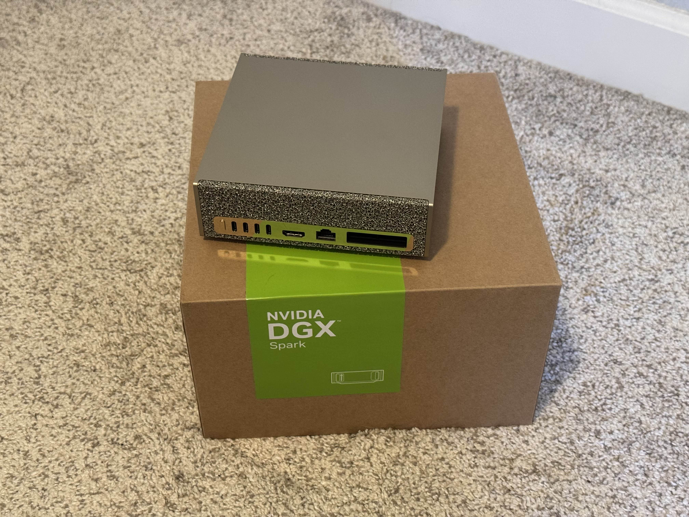

This month, there's been a new release, lots of infrastructure work, and a bunch more packages

## Status report

### Brioche v0.1.6 released

Shortly after the last status update, we released [Brioche v0.1.6](/blog/brioche-v0-1-6), so if you missed the news go check it out! The headline feature is official support for aarch64 Linux as a platform, but there are lots of other goodies packed in the release too.

Internally, this was the first time we got to use [our new release process](/blog/brioche-v0-1-6/#release-process-changes) to cut the release (which I also [talked about in last month's Project Update](/blog/project-update-2025-10/#installer--release-work)). Mostly, this was exciting because it didn't blow up!

### `setup-brioche` action overhaul

The new release came from our new release process. Our new release process included a new installer script. The new installer script also enabled us to massively simplify our [`setup-brioche`](https://github.com/brioche-dev/setup-brioche) GitHub Action.

The initial version of the `setup-brioche` action bundled its own install script, which was nearly identical to the (old) install script. But, it started to grow out as we added features. That also meant any changes to the main install script needed to be ported over to the action too.

Now, the new install script ([`brioche-installer`](https://github.com/brioche-dev/brioche-installer)) includes all the custom functionality that was originally just added to the `setup-brioche` script (opt-in, of course). So now, `setup-brioche` can just pull the official installer and run it!

But, from a supply-chain security perspective, fetching and executing a live-updating shell script is... uh... somewhat risky! To help matters, the installer script itself is code-signed, and we explicitly check the signature before running the installer. I feel this helps us maintain a strong security posture for the action, along with _massively_ simplifying the maintenance.

### New aarch64 runner

For `brioche-package` builds, we use our own self-hosted runners. Specifically, we have a Minisforum mini PC as an x86-64 runner, and an M1 Mac mini as an aarch64 runner (running [Asahi Linux](https://asahilinux.org/)).

For some time now, the aarch64 builds have been a bottleneck in our package builds (not that the Mac mini is a slouch! But it's not quite at the core count we'd want for building packages). To help it out, a new Nvidia DGX Spark joined the fray!

I might be one of the few people who bought this thing _not_ for AI stuff. I've been watching this space for a while, and I believe it's the first ARM-based mini PC _not_ made by Apple that reaches the performance level of Apple's M1.

...and for better or for worse, it was the best option I had for another aarch64 build machine. Ampere's stuff is interesting, but more targetted for enterprises I think and not really consumer-facing; Qualcomm has _talked about_ ARM PCs for quite a while without really shipping anything I could get my hands on today; Minisforum shipped the [MS-R1](https://www.minisforum.com/products/ms-r1) recently but performance isn't stellar from what I've read; Apple's making some really solid stuff, but Asahi only supports M1/M2, so using Mac hardware would either mean buying older hardware for Asahi support or virtualizing Linux on top of macOS (more painful to manage).

Together, the DGX Spark and the Mac mini are keeping ARM builds roughly on pace with x86-64. That's good because that's cleared a bottleneck in our build pipelines!

(I was kind of hoping the DGX Spark alone could keep up with the x86-64 runner, but that hasn't really played out. That said, I've seen some slowness on both the DGX Spark _and_ the Mac mini that makes me want to dig in more on general performance of aarch64 for Brioche + our CI pipeline. I'm not ready to make any claims about the DGX Spark's performance, to be honest!)

### Python packaging fixes

For a long time, our `meson` has had an issue where it would try to use the wrong Python interpreter (issue [#838](https://github.com/brioche-dev/brioche-packages/issues/838)). Basically, the `bin/meson` script ended up with a shebang with an invalid path (well, a path that was only valid within a single instance of the sandbox).

Well, [**@jaudiger**](https://github.com/jaudiger) opened [#1669](https://github.com/brioche-dev/brioche-packages/pull/1669), which finally fixed this for good by using a proper shebang. Now, `bin/meson` uses the shebang line `#!/usr/bin/env sh` with a small _polyglot script_ to execute the actual Python interpreter. This fix is also reusable and applies to other Python-based packages too!

### Lots more foundational X11 packages

[**@jaudiger**](https://github.com/jaudiger) has been busy adding a bunch of new packages related to X11/X.Org. We don't have any GUI-based packages in Brioche yet, but all of these dependencies are prerequisites on the path to getting the first one added!

### Infrastructure rework

Our GitHub Actions runners are managed with GitHub's (in)famous [Actions Runner Controller](https://github.com/actions/actions-runner-controller) for Kubernetes. Previously, I set things up the lazy way by creating a separate Kubernetes "cluster" for each runner-- not really ideal!

With the new DGX Spark runner, I used this as a chance to overhaul the Kubernetes setup used for Brioche stuff. Now, each of our 3 runners are part of a single cluster, which makes it easy to view and manage all the runners together!

Actually, I'm hoping this is a 2-for-1 deal. Today, a lot of Brioche's infrastructure is hosted by Cloudflare (plus some parts using [Fly.io](https://fly.io/) and [Neon](https://neon.com/)). I've honestly been unhappy with using Cloudflare for a long time[^cloudflare], and have long had the itch to move. Recently, I was inspired by [Grebedoc](https://grebedoc.dev/) and the modest infrastructure that powers it. So this month, I've been trying to get all the pieces in place for a "production-ready" Kubernetes cluster for self-hosting more Brioche infrastructure.

It's been... pretty painful getting everything working! But my hope is that this will be a long-term investment to keep Brioche's infrastructure small, sustainable, reliable, and fast! I'm hoping to write a lot more words about what I've been cooking once I've got more to share.

## Housekeeping

### New packages

Since the last update, there were **48** new packages.

New packages:

- `aicommit2`
- `cargo_leptos`
- `chezmoi`
- `corrosion`
- `datafusion_cli`
- `delta`
- `dumbpipe`
- `font_util`
- `fontconfig`
- `fonttools`
- `git_spice`
- `harsh`
- `helm`
- `helm_docs`
- `helmfile`
- `helmify`
- `httm`
- `impala`
- `leetcode_cli`
- `libev`
- `libfontenc`
- `libimagequant`
- `libpciaccess`
- `libxcvt`
- `libxft`
- `libxinerama`
- `libxkbfile`
- `libxshmfence`
- `libxxf86dga`
- `libxxf86vm`
- `lzlib`
- `markdown_oxide`
- `mergiraf`
- `nexttrace`
- `numcpp`
- `ov`
- `parqeye`
- `pixman`
- `rulesync`
- `rustnet`
- `stylelint`
- `topiary`
- `vfox`
- `vtcode`
- `xauth`
- `xcb_util`
- `xcb_util_errors`
- `xcb_util_image`

### Brioche core updates

- [#363](https://github.com/brioche-dev/brioche/pull/363): Update Cargo configuration
- [#364](https://github.com/brioche-dev/brioche/pull/364): Work around race condition between "didOpen" and "diagnostic" LSP messages
- [#366](https://github.com/brioche-dev/brioche/pull/366): Update LSP to load documents atomically
- [#367](https://github.com/brioche-dev/brioche/pull/367): ci: remove old hack, now Brioche 0.1.6 is out

[^cloudflare]: Even from day one, I wasn't super enthusiastic about using Cloudflare. Their [outage this month](https://blog.cloudflare.com/18-november-2025-outage/) was timely-- although I'm not really concerned about their uptime, but I don't like how centralized they've helped make the Web. More concerning to me is their policies and who they openly support. They [did stop protecting Kiwi Farms-- eventually](https://blog.cloudflare.com/kiwifarms-blocked/) (good). But there's also a notorious forum centered on self-harm-- [there's a great video esssay about it by Tantacrul](https://www.youtube.com/watch?v=C3y6SsGAWks)-- which Cloudflare still protects _today_. They also [proudly sponsor](https://blog.cloudflare.com/supporting-the-future-of-the-open-web/) the projects Omarchy (the Linux distro made by DHH, [who is a white supremacist](https://jakelazaroff.com/words/dhh-is-way-worse-than-i-thought/)) and Ladybird (the browser started by Andreas Kling, [who feels that gender-neutral langauge is "political" and, therefore, not welcome in his projects](https://github.com/SerenityOS/serenity/pull/6814)). Life's too short, and I'd rather support providers I like. Cloudflare does not spark joy.
